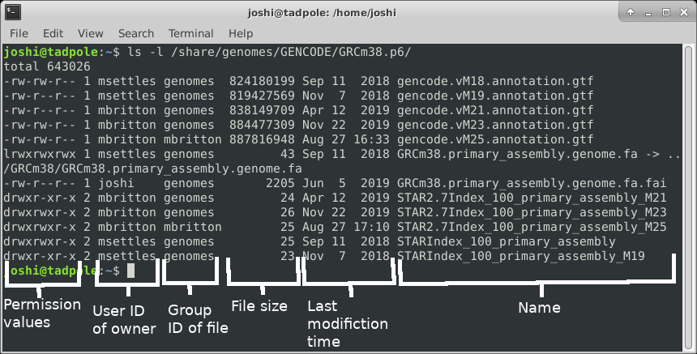
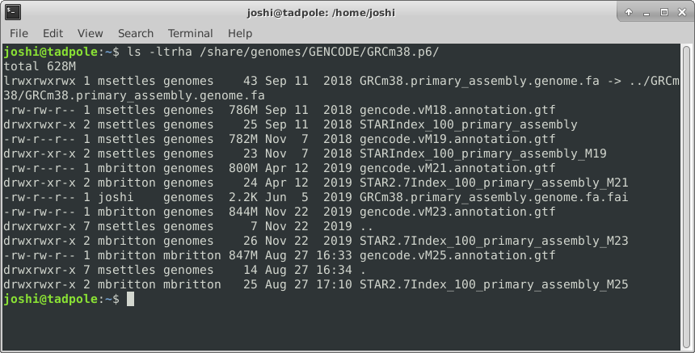
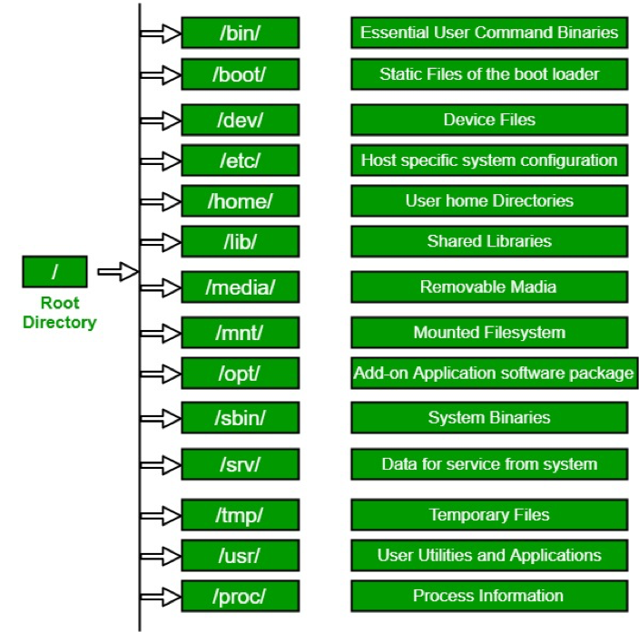

# Introduction to Command Line Interface

## Outline:
1. What is the command line?
2. Directory Structure 
3. Syntax of a Command
4. Options of a Command
5. Command Line Basics (ls, pwd, Ctrl-C, man, alias, ls -lthra)
6. Getting Around (cd)
7. Absolute and Relative Paths
8. Tab Completion
9. History Repeats Itself (history, head, tail, <up arrow>)
10. Editing Yourself (Ctrl-A, Ctrl-E, Ctrl-K, Ctrl-W)
11. Create and Destroy (echo, cat, rm, rmdir)
12. Transferring Files (scp)
13. Piping and Redirection (\|, >, >>, cut, sort, grep)
14. Compressions and Archives (tar, gzip, gunzip)
15. Forced Removal (rm -r)
16. BASH Wildcard Characters (?, *, find, environment variables($), quotes/ticks)
17. Manipulation of a FASTA file (cp, mv, wc -l/-c)
18. Symbolic Links (ln -s)
19. STDOUT and STDERR (>1, >2)
20. Paste Command (paste, for loops)
21. Shell Scripts and File Permissions (chmod, nano, ./)

### A CLI cheat sheet

<object data="https://files.fosswire.com/2007/08/fwunixref.pdf" type="application/pdf" width="700px" height="700px">
    <embed src="https://docs.conda.io/projects/conda/en/4.6.0/_downloads/52a95608c49671267e40c689e0bc00ca/conda-cheatsheet.pdf">
        
This browser does not support PDFs. Please download the PDF to view it: <a href="http://yoursite.com/the.pdf">Download PDF</a>.

    </embed>
</object>

# Session 1

## What is the Command-Line Interface

* The CLI is a tool into which one can type commands to perform tasks.
* The user interface that accepts the typed responses and displays the data on the screen is called a shell: bash, tcsh…
* An all-text display (most of the time your mouse doesn't work)

After opening or logging into a terminal, system messages are often displayed, followed by the "prompt".
A prompt is a short text message at the start of the command line and ends with '$' in bash shell, commands are typed after the prompt. The prompt typically follows the form **username@server:current_directory$**.

## Command Line Basics

First some basics - how to look at your surroundings.

    pwd

present working directory ... where am I?

    ls

list files here ... you should see nothing since your homes are empty

    ls /tmp/

list files somewhere else, like /tmp/

Because one of the first things that's good to know is *how to escape once you've started something you don't want*.

    sleep 1000  # wait for 1000 seconds!

Use Ctrl-c (shows as '^C' in the terminal) to exit (kill) a command. In some cases, a different key sequence is required (Ctrl-d). Note that anything including and after a "#" symbol is ignored, i.e. a comment. **So in all the commands below, you do not have to type anything including and past a "#".**

#### Options

Each command can act as a basic tool, or you can add 'options' or 'flags' that modify the default behavior of the tool. These flags come in the form of '-v' ... or, when it's a more descriptive word, two dashes: '\-\-verbose' ... that's a common (but not universal) one that tells a tool that you want it to give you output with more detail. Sometimes, options require specifying amounts or strings, like '-o results.txt' or '\-\-output results.txt' ... or '-n 4' or '\-\-numCPUs 4'. Let's try some, and see what the man page for the 'list files' command 'ls' is like.

    ls -R /

Lists directories and files *recursively*. This will be a very long output, so use Ctrl-C to break out of it. Sometimes you have to press Ctrl-C many times to get the terminal to recognize it. In order to know which options do what, you can use the manual pages. To look up a command in the manual pages type "man" and then the command name. So to look up the options for "ls", type:

    man ls

Navigate this page using the up and down arrow keys, PageUp and PageDown, and then use q to quit out of the manual. In this manual page, find the following options, quit the page, and then try those commands. You could even open another terminal, log in again, and run manual commands in that terminal.

    ls -l /usr/bin/ # long format, gives permission values, owner, group, size, modification time, and name

    ls -a /lib # shows ALL files, including hidden ones

    ls -l -a /usr/bin # does both of the above

    ls -la /usr/bin # option 'smushing' can be done with single letter options

    ls -ltrha /usr/bin # shows all files, long format, in last modified time reverse order, with human readable sizes

    
And finally adding color (white for regular files, blue for directories, turquoise for links): 

    ls -ltrha --color /usr/bin # single letter (smushed) vs word options (Linux)
    
**OR**

    ls -ltrhaG /usr/bin # (MacOS)

Quick aside: what if I want to use same options repeatedly? and be lazy? You can create a shortcut to another command using 'alias'.

    alias ll='ls -lah'
    ll

## Directory Structure

Absolute path: always starts with ”/” - the root folder

/share/workshop/msettles/cli

the folder (or file) "cli" in the folder "msettles" in the folder "workshop" in the folder "share" from the root folder.

Relative path: always relative to our current location.

_a single dot (.) refers to the current directory_  
_two dots (..) refers to the directory one level up_  

Usually, /home is where the user accounts reside, ie. users' 'home' directories.
For example, for a user that has a username of “msettles”: their home directory is /home/msettles
It is the directory that a user starts in after starting a new shell or logging into a remote server.

The tilde (~) is a short form of a user’s home directory.

## Syntax of a command

* A command plus the required parameters/arguments
* The separator used in issuing a command is space, number of spaces does not matter

## Quiz 1

<button id="submit1">Submit Quiz</button>

## Getting Around

The filesystem you're working on is like the branching root system of a tree. The top level, right at the root of the tree, is called the 'root' directory, specified by '/' ... which is the divider for directory addresses, or 'paths'. We move around using the 'change directory' command, 'cd'. The command pwd return the present working directory.

    cd  # no effect? that's because by itself it sends you home (to ~)
    cd /  # go to root of tree's root system
    cd home  # go to where everyone's homes are
    pwd
    cd username  # use your actual home, not "username"
    pwd
    cd /
    pwd
    cd ~  # a shortcut to home, from anywhere
    pwd
    cd .  # '.' always means *this* directory
    pwd
    cd ..  # '..' always means *one directory up*
    pwd

**You should also notice the location changes in your prompt.**

## Absolute and Relative Paths

You can think of paths like addresses. You can tell your friend how to go to a particular store *from where they are currently* (a 'relative' path), or *from the main Interstate Highway that everyone uses* (in this case, the root of the filesystem, '/' ... this is an 'absolute' path). Both are valid. But absolute paths can't be confused, because they always start off from the same place, and are unique. Relative paths, on the other hand, could be totally wrong for your friend *if you assume they're somewhere they're not*. With this in mind, let's try a few more:

    cd /usr/bin  # let's start in /usr/bin

**relative** (start here, take one step up, then down through lib and gcc)

    cd ../lib/X11 # windows and linux do this one
    cd ../lib/system # macs do this one
    pwd

**absolute** (start at root, take steps)

    cd /usr/lib/X11 # windows and linux
    cd /usr/lib/system # macs
    pwd

Now, because it can be a real pain to type out, or remember these long paths, we need to discuss ...

## Tab Completion

Using tab-completion is a must on the command line. A single \<tab\> auto-completes file or directory names when there's only one name that could be completed correctly. If multiple files could satisfy the tab-completion, then nothing will happen after the first \<tab\>. In this case, press \<tab\> a second time to list all the possible completing names. Note that if you've already made a mistake that means that no files will ever be completed correctly from its current state, then \<tab\>'s will do nothing.

touch updates the timestamp on a file, here we use it to create three empty files.

    cd # go to your home directory
    mkdir ~/tmp
    cd ~/tmp
    touch one seven september
    ls o

tab with no enter should complete to 'one', then enter

    ls s

tab with no enter completes up to 'se' since that's in common between seven and september. tab again and no enter, this second tab should cause listing of seven and september. type 'v' then tab and no enter now it's unique to seven, and should complete to seven. enter runs 'ls seven' command.

It cannot be overstated how useful tab completion is. You should get used to using it constantly. Watch experienced users type and they maniacally hit tab once or twice in between almost every character. You don't have to go that far, of course, but get used to constantly getting feedback from hitting tab and you will save yourself a huge amount of typing and trying to remember weird directory and filenames.

## Quiz 2

<button id="submit2">Submit Quiz</button>

HOMEWORK
---------

Practice moving around directories from the root directory. Practice listing directories and moving around to different directories using both absolute and relative paths. Make sure to practice and use tab-completion a lot! Find your root directory in a File Explorer and practice navigating there and then doing the same navigation on the command-line.
