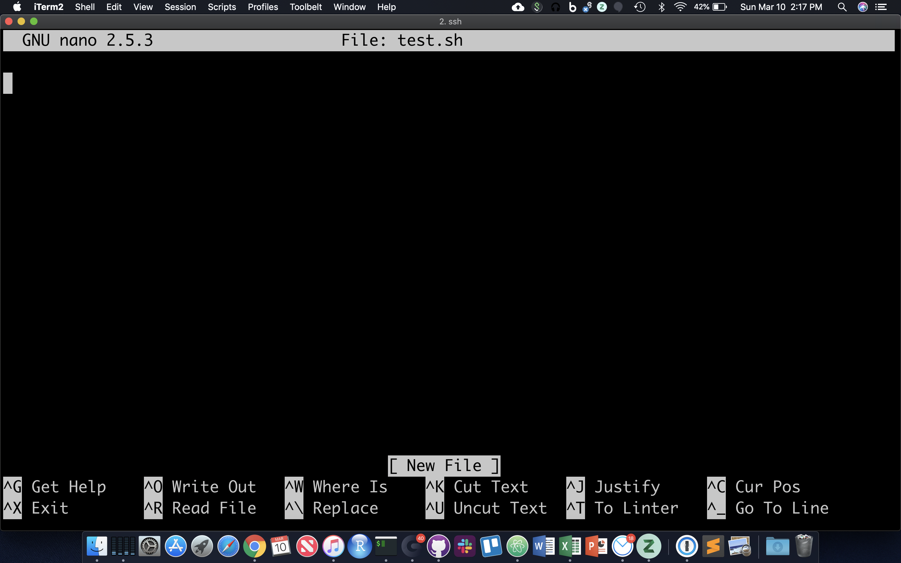

# Session 3

The sed command
----------------

Let's take a look at the 'sed' command. **NOTE: On Macs use 'gsed'**. sed (short for stream editor) is a command that allows you to manipulate character data in various ways. One useful thing it can do is substitution. Let's download a simple file to work on:

    wget https://raw.githubusercontent.com/ucdavis-bioinformatics-training/2021-June-Introduction-to-the-Command-Line-for-Bioinformatics/master/cli/region.bed -O region.bed

Take a look at the file:

    cat region.bed

Now, let's make all the uppercase "CHR"s into lowercase:

    cat region.bed | sed 's/CHR/chr/'

What happened? Only the first CHR changed. That is because we need to add the "g" option:

    cat region.bed | sed 's/CHR/chr/g'

We can also do the the substitution without regards to case:

    cat region.bed | sed 's/chr/chr/gi'

Let's break down the argument to sed (within the single quotes)... The "s" means "substitute", the word between the 1st and 2nd forward slashes (i.e. /) is the word the substitute for, the word between the 2nd and 3rd slashes is the word to substitute with, and finally the "gi" at the end are flags for global substitution (i.e. substituting along an entire line instead of just the first occurence on a line), and for case insenstivity (i.e. it will ignore the case of the letters when doing the substitution).

Note that this **doesn't** change the file itself, it is simply piping the output of the cat command to sed and outputting to the screen. If you wanted to change the file itself, you could use the "-i" option to sed:

    cat region.bed
    sed -i 's/chr/chr/gi' region.bed

Now if you look at the file, the lines have changed.

    cat region.bed

Another useful use of sed is for capturing certain lines from a file. You can select certain lines from a file:

    sed '4q;d' region.bed

This will just select the 4th line from the file.

You can also extract a range of lines from a file:

    sed -n '10,20p' region.bed

This gets the 10th through 20th lines from the file.

**CHALLENGE:**
See if you can find a way to use sed to remove all the "CHR"s from the file.

More pipes
-----------

Now, let's delve into pipes a little more. Pipes are a very powerful way to look at and manipulate complex data using a series of simple programs. Let's look at some fastq files. Get a few small fastq files:

    wget https://raw.githubusercontent.com/ucdavis-bioinformatics-training/2022-Jan-Introduction-to-the-Command-Line-for-Bioinformatics/master/cli/C61.subset.fq.gz -O C61.subset.fq.gz
    wget https://raw.githubusercontent.com/ucdavis-bioinformatics-training/2022-Jan-Introduction-to-the-Command-Line-for-Bioinformatics/master/cli/I561.subset.fq.gz -O I561.subset.fq.gz
    wget https://raw.githubusercontent.com/ucdavis-bioinformatics-training/2022-Jan-Introduction-to-the-Command-Line-for-Bioinformatics/master/cli/I894.subset.fq.gz -O I894.subset.fq.gz

Since the files are gzipped files we need to use "zcat" to look at them (mac users may have to use "gzcat"). zcat is just like cat except for gzipped files:

    zcat C61.subset.fq.gz | head

Fastq records are 4 lines per sequence, a header line, the sequence, a plus sign (which is historical), and then the quality encoding for the sequence. Notice that each header line has the barcode for that read at the end of the line. Let's count the number of each barcode. In order to do that we need to just capture the header lines from this file. We can use "sed" to do that:

    zcat C61.subset.fq.gz | sed -n '1~4p' | head

By default sed prints every line. In this case we are giving the "-n" option to sed which will **not** print every line. Instead, we are giving it the argument "1\~4p", which means to print the first line, then skip 4 lines and print again, and then continue to do that.

Now that we have a way to get just the headers, we need to isolate the part of the header that is the barcode. There are multiple ways to do this... we will use the cut command:

    zcat C61.subset.fq.gz | sed -n '1~4p' | cut -d: -f10 | head

So we are using the "-d" option to cut with ":" as the argument to that option, meaning that we will be using the delimiter ":" to split the input. Then we use the "-f" option with argument "10", meaning that we want the 10th field after the split. In this case, that is the barcode.

Finally, as before, we need to sort the data and then use "uniq -c" to count. Then put it all together and run it on the entire dataset (This will take about a minute to run):

    zcat C61.subset.fq.gz | sed -n '1~4p' | cut -d: -f10 | sort | uniq -c

Now you have a list of how many reads were categorized into each barcode. Here is a [sed tutorial](https://www.digitalocean.com/community/tutorials/the-basics-of-using-the-sed-stream-editor-to-manipulate-text-in-linux) for more exercises.

**CHALLENGE:**
Find the distribution of the first 5 bases of all the reads in C61.subset.fq.gz. I.e., count the number of times the first 5 bases of every read occurs across all reads.

Loops
------

Loops are useful for quickly telling the shell to perform one operation after another, in series. For example:

    for i in {1..21}; do echo $i >> a; done  # put multiple lines of code on one line, each line terminated by ';'
    cat a
    # <1 through 21 on separate lines>

The general form is:

for name in {list}; do
    commands
done

The list can be a sequence of numbers or letters, or a group of files specified with wildcard characters:

    for i in {3,2,1,liftoff}; do echo $i; done  
    for x in *.fq.gz; do echo $x; zcat $x | wc -l; done

 A "while" loop is more convenient than a "for" loop ... if you don't readily know how many iterations of the loop you want:

while {condition}; do
    commands
done

Now, let's do some bioinformatics-y things with loops and pipes. First, let's write a command to get the nucleotide count of the first 10,000 reads in a file. Use zcat and sed to get only the read lines of a file, and then only take the first 10,000:

    zcat C61.subset.fq.gz | sed -n '2~4p' | head -10000 | less

Use grep's "-o" option to get each nucleotide on a separate line (take a look at the man page for grep to understand how this works):

    zcat C61.subset.fq.gz | sed -n '2~4p' | head -10000 | grep -o . | less

Finally, use sort and uniq to get the counts:

    zcat C61.subset.fq.gz | sed -n '2~4p' | head -10000 | grep -o . | sort | uniq -c

 264012 A
 243434 C
 215045 G
    278 N
 277231 T

And, voila, we have the per nucleotide count for these reads!

We just did this for one file, but what if we wanted to do it for all of our files? We certainly don't want to type the command by hand dozens of times. So we'll use a while loop. You can pipe a command into a while loop and it will iterate through each line of the input. First, get a listing of all your files:

    ls -1 *.fq.gz

Pipe that into a while loop and read in the lines into a variable called "x". We use "$x" to get the value of the variable in that iteration of the loop:

    ls -1 *.fq.gz | while read x; do echo $x is being processed...; done

Add the command we created above into the loop, placing $x where the filename would be and semi-colons inbetween commands:

    ls -1 *.fq.gz | while read x; do echo $x is being processed...; zcat $x | sed -n '2~4p' | head -10000 | grep -o . | sort | uniq -c; done

When this runs it will print the name of every single file being processed and the nucleotide count for the reads from those files.

Now, let's say you wanted to write the output of each command to a separate file. We would redirect the output to a filename, but we need to create a different file name for each command and we want the file name to reflect its contents, i.e. the output file name should be based on the input file name. So we use "parameter expansion", which is fancy way of saying substitution:

    ls -1 *.fq.gz | while read x; do echo $x is being processed...; zcat $x | sed -n '2~4p' | head -10000 | grep -o . | sort | uniq -c > ${x%.fq.gz}.nucl_count.txt; done

This will put the output of the counting command into a file whose name is the prefix of the input file plus ".nucl_count.txt". It will do this for every input file.

## Manipulation of a FASTA File

Let's copy the phiX-174 genome (using the 'cp' command) to our current directory so we can play with it:

    cp ./PhiX/Illumina/RTA/Sequence/WholeGenomeFasta/genome.fa phix.fa    

Similarly we can also use the move command here, but then ./PhiX/Illumina/RTA/Sequence/WholeGenomeFasta/genome.fa will no longer be there:

    cp ./PhiX/Illumina/RTA/Sequence/WholeGenomeFasta/genome.fa  ./PhiX/Illumina/RTA/Sequence/WholeGenomeFasta/genome2.fa
    ls ./PhiX/Illumina/RTA/Sequence/WholeGenomeFasta/
    mv ./PhiX/Illumina/RTA/Sequence/WholeGenomeFasta/genome2.fa phix.fa
    ls ./PhiX/Illumina/RTA/Sequence/WholeGenomeFasta/

This functionality of mv is why it is used to rename files.

Note how we copied the 'genome.fa' file to a different name: 'phix.fa'

    wc -l phix.fa

count the number of lines in the file using 'wc' (word count) and parameter '-l' (lines).

We can use the 'grep' command to search for matches to patterns. 'grep' comes from '**g**lobally search for a **r**egular **e**xpression and **p**rint'.

    grep -c '>' phix.fa

Only one FASTA sequence entry, since only one header line ('>gi\|somethingsomething...')

    cat phix.fa

This may not be useful for anything larger than a virus! Let's look at the start codon and the two following codons:

    grep --color "ATG......" phix.fa

'.' characters are the single-character wildcards for grep. So "ATG......" matches any set of 9 characters that starts with ATG.

Use the --color  '-o' option to **o**nly print the pattern matches, one per line

    grep -o "ATG......" phix.fa

Use the 'cut' command with '-c' to select characters 4-6, the second codon

    grep --color  -o "ATG......" phix.fa | cut -c4-6

'sort' the second codon sequences (default order is same as ASCII table; see 'man ascii')

    grep --color  -o "ATG......" phix.fa | cut -c4-6 | sort

Combine successive identical sequences, but count them using the 'uniq' command with the '-c' option

    grep --color  -o "ATG......" phix.fa | cut -c4-6 | sort | uniq -c

Finally sort using reverse numeric order ('-rn')

    grep --color  -o "ATG......" phix.fa | cut -c4-6 | sort | uniq -c | sort -rn

... which gives us the most common codons first

This may not be a particularly useful thing to do with a genomic FASTA file, but it illustrates the process by which one can build up a string of operations, using pipes, in order to ask quantitative questions about sequence content. More generally than that, this process allows one to ask questions about files and file contents and the operating system, and verify at each step that the process so far is working as expected. The command line is, in this sense, really a modular workflow management system.

## Shell Scripts, File Permissions

Often it's useful to define a whole string of commands to run on some input, so that (1) you can be sure you're running the same commands on all data, and (2) so you don't have to type the same commands in over and over! Let's use the 'nano' text editor program that's pretty reliably installed on most linux systems.

    nano test.sh

nano now occupies the whole screen; see commands at the bottom. Let's type in a few commands. First we need to put the following line at the top of the file:

#!/bin/bash

The "#!" at the beginning of a script tells the shell what language to use to interpret the rest of the script. In our case, we will be writing "bash" commands, so we specify the full path of the bash executable after the "#!". Then, add some commands:

#!/bin/bash

echo "Start script..."
pwd
ls -l
sleep 10
echo "End script."

Hit Cntl-O and then enter to save the file, and then Cntl-X to exit nano.

Though there are ways to run the commands in test.sh right now, it's generally useful to give yourself (and others) 'execute' permissions for test.sh, really making it a shell script. Note the characters in the first (left-most) field of the file listing:

    ls -lh test.sh

-rw-rw-r-- 1 msettles biocore 79 Aug 19 15:05 test.sh

The first '-' becomes a 'd' if the 'file' is actually a directory. The next three characters represent **r**ead, **w**rite, and e**x**ecute permissions for the file owner (you), followed by three characters for users in the owner's group, followed by three characters for all other users. Run the 'chmod' command to change permissions for the 'test.sh' file, adding execute permissions ('+x') for the user (you) and your group ('ug'):

    chmod ug+x test.sh
    ls -lh test.sh

-rwxr-xr-- 1 msettles biocore 79 Aug 19 15:05 test.sh

The first 10 characters of the output represent the file and permissions.
The first character is the file type, the next three sets of three represent the file permissions for the user, group, and everyone respectively.
- r = read
- w = write
- x = execute

So let's run this script. We have to provide a relative reference to the script './' because its not our our "PATH".:

    ./test.sh

And you should see all the commands in the file run in sequential order in the terminal.

## Command Line Arguments for Shell Scripts

Now let's modify our script to use command line arguments, which are arguments that can come after the script name (when executing) to be part of the input inside the script. This allows us to use the same script with different inputs. In order to do so, we add variables $1, $2, $3, etc.... in the script where we want our input to be. So, for example, use nano to modify your test.sh script to look like this:

#!/bin/bash

echo "Start script..."
PWD=`pwd`
echo "The present working directory is $PWD"
ls -l $1
sleep $2
wc -l $3
echo "End script."

Now, rerun the script using command line arguments like this:

    ./test.sh genome.fa 15 PhiX/Illumina/RTA/Annotation/Archives/archive-2013-03-06-19-09-31/Genes/ChromInfo.txt

Note that each argument is separated by a space, so $1 becomes "genome.fa", $2 becomes "15", and $3 becomes "PhiX/Illumina/RTA/Annotation/Archives/archive-2013-03-06-19-09-31/Genes/ChromInfo.txt". Then the commands are run using those values. Now rerun the script with some other values:

    ./test.sh .. 5 genome.fa

Now, $1 becomes "..", $2 is "5", and $3 is "genome.fa".

## Pipes and Loops inside scripts

Open a new text file using the text editor "nano":

    nano get_nucl_counts.sh

Copy and Paste the following into the file:

#!/bin/bash

zcat $1 | sed -n '2~4p' | head -$2 | grep -o . | sort | uniq -c

Save the file and exit. Change the permissions on the file to make it executable:

    chmod a+x get_nucl_counts.sh

Now, we can run this script giving it different arguments every time. The first argument (i.e. the first text after the script name when it is run) will get put into the variable "$1". The second argument (delimited by spaces) will get put into "$2". In this case, "$1" is the file name, and "$2" is the number of reads we want to count. So, then we can run the script over and over again using different values and the command will run based on those values:

    ./get_nucl_counts.sh I561.subset.fq.gz 1000
    ./get_nucl_counts.sh I561.subset.fq.gz 10000
    ./get_nucl_counts.sh C61.subset.fq.gz 555

We can also put loops into a script. We'll take the loop we created earlier and put it into a file, breaking it up for readability and using backslashes for line continuation:

    nano get_nucl_counts_loop.sh

Put this in the file and save it:

#!/bin/bash

ls -1 *.fq.gz | \
while read x; do \
    echo $x is being processed...; \
    zcat $x | sed -n '2~4p' | head -$1 | \
        grep -o . | sort | uniq -c > ${x%.fq.gz}.nucl_count.txt; \
done

Make it executable:

    chmod a+x get_nucl_counts_loop.sh

And now we can execute the entire loop using the script. Note that there is only one argument now, the number of reads to use:

    ./get_nucl_counts_loop.sh 100

## Quiz 5

<button id="submit5">Submit Quiz</button>

HOMEWORK
---------

Using the region.bed file, find the distance between the start and end coordinates for every line. You should be able to do this using only the command line. You will probably need to use the backtick characters to store the result of a command in a variable and you will also need to use the **expr** command. Look at the manual page for **expr** to learn how to use it. Once you have that figured out, create a shell script that will take a chromosome name as input and then will find the distances on each line for only that chromosome.
